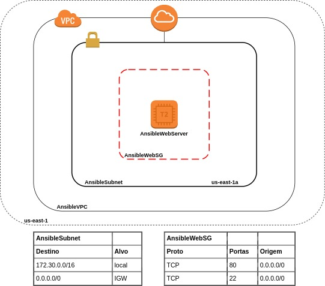

# Codigo N. 1

## Objetivo do Playbook

+ Provisionar uma estrutura básica com ansible; 
+ Diagrama da estrutura que será provisionada:



## Explicando o código

+ Neste tópico será explicado o código e cada módulo ansible será referenciado sua página na documentação;
+ É necessário saber um pouco de AWS para entender o que está sendo criado;
+ A explicação será dividida em blocos;
+ Cada bloco terá linhas marcadas por **\<\>**, que serão explicadas abaixo do código.

### Código

#### 1º Bloco:

  ```1
  ---
    - name: AWS #<1>
      hosts: localhost 
      gather_facts: false  
      vars: 
        - profile: aws #<2>
        - region: us-east-1
        - user: vagrant
        - group: vagrant
      vars_prompt: #<3>
        - name: state 
          prompt: "Escreva absent para destruir"
          private: false
  ```

+ **<1>**: Esse inicio é necessário seguir o passo a passo do [Amazon Web Services Guide](https://docs.ansible.com/ansible/latest/scenario_guides/guide_aws.html) e instalar as dependências;
+ **<2>**: O profile é uma referência ao arquivo [.aws/credentials](https://docs.aws.amazon.com/cli/latest/userguide/cli-configure-files.html) da AWS;
+ **<3>**: Os [prompts](https://docs.ansible.com/ansible/latest/user_guide/playbooks_prompts.html) são utilizados para receber informações do usuário e armazenar essa informação na variável declarada na linha *name:*, no caso variável *state*. 

#### 2º Bloco

  ```2
      tasks:

        - name: VPC Created
          ec2_vpc_net: #<1>
            name: AnsibleVPC
            cidr_block: 172.30.0.0/16
            region: "{{ region }}"
            profile: "{{ profile }}"
            tags:
              Name: AnsibleVPC
              Organization: AnsPlay
          register: vpcReg #<2>
  ```

+ **<1>**: Será criada uma rede virtual(VPC) na AWS, utilizando o módulo [ec2\_vpc\_net](https://docs.ansible.com/ansible/latest/modules/ec2_vpc_net_module.html);
+ **<2>**: O [register](https://docs.ansible.com/ansible/latest/user_guide/playbooks_variables.html#registering-variables) é utilizado para armazenar a saída do comando em variável. 

#### 3º Bloco:

  ```3
        - name: IGW Created 
          ec2_vpc_igw: #<1>
            vpc_id: "{{ vpcReg.vpc.id }}" #<2>
            region: "{{ region }}"
            profile: "{{ profile }}"
            tags:
              Name: AnsibleIGW
              Organization: AnsPlay
          register: igwReg
  ```

+ **<1>**: Será criado uma Internet Gateway para permitir a comunicação à internet, foi usado o módulo [ec2\_vpc\_igw](https://docs.ansible.com/ansible/latest/modules/ec2_vpc_igw_module.html);
+ **<2>**: Aqui será referenciado um atributo da variável de retorno [vpcReg](https://docs.ansible.com/ansible/latest/modules/ec2_vpc_net_module.html#return-values), a maioria dos módulos tem seu retorno de valores na sua documentação, lembrando que os módulos sempre retorna um conteúdo em JSON. 

#### 4º Bloco:

  ```4
        - name: Subnet Created
          ec2_vpc_subnet: #<1>
            vpc_id: "{{ vpcReg.vpc.id }}"
            cidr: 172.30.1.0/24
            map_public: true 
            region: "{{ region }}"
            profile: "{{ profile }}"
            az: us-east-1a
            tags:
              Name: AnsibleSubnet
              Organization: AnsPlay
          register: subReg
  ```

+ **<1>**: Será criado uma sub-rede, utilizando o módulo [ec2\_vpc\_subnet](https://docs.ansible.com/ansible/latest/modules/ec2_vpc_subnet_module.html).

#### 5º Bloco:

  ```5
        - name: Route Table Created
          ec2_vpc_route_table: #<1>
            vpc_id: "{{ vpcReg.vpc.id }}"
            profile: "{{ profile }}"
            region: "{{ region }}"
            subnets:
              - "{{ subReg.subnet.id }}"
            routes:
              - dest: 0.0.0.0/0
                gateway_id: "{{ igwReg.gateway_id }}"
            tags:
              Name: AnsiblePublicRt
              Organization: AnsPlay
          register: rtReg
  ```

+ **<1>**: Vai ser criado uma tabela de rota, aonde qualquer ip pode ter acesso ao internet gateway e a subnet criada vai ser anexada a essa tabela. Foi utilzado o módulo [ec2\_vpc\_route\_table](https://docs.ansible.com/ansible/latest/modules/ec2_vpc_route_table_module.html).

#### 6º Bloco:

  ```6
        - name: Web Security Group Created
          ec2_group: #<1>
            name: Web Security Group
            description: Abrir as portas 80 e 22
            profile: "{{ profile }}"
            region: "{{ region }}"
            vpc_id: "{{ vpcReg.vpc.id }}"
            rules:
              - proto: tcp
                ports:
                  - 80 
                  - 22 
                cidr_ip: 0.0.0.0/0
                rule_desc: Permite a entrada de qualquer ip nas portas 80 e 22
            tags:
              Name: AnsibleWebSG
              Organization: AnsPlay
          register: sgReg
  ```

+ **<1>**: Será criado um firewall virtual para as instâncias, onde será permitido a entrada de qualquer ip nas portas 80(HTTP) e 22(SSH), foi usado o módulo [ec2\_group](https://docs.ansible.com/ansible/latest/modules/ec2_group_module.html). 

#### 7º Bloco:

  ```7
        - name: Aws KeyPair
          block: #<1>
            - name: KeyPair Created
              ec2_key: #<2>
                name: ansible
                profile: "{{ profile }}"
                region: "{{ region }}"
              register: keyReg

            - name: KeyPair Saved
              copy: #<3>
                content: "{{ keyReg.key.private_key }}"
                dest: ansible.pem
                remote_src: true
                owner: "{{ user }}"
                group: "{{ group }}"
                mode: '0400'
              when: keyReg.msg == "key pair created" #<4>
  ```

+ **<1>**: O [block](https://docs.ansible.com/ansible/latest/user_guide/playbooks_blocks.html) é utilizado para agrupar lógicamente as tasks, aqui foi utilizado para deixar o código mais legível;
+ **<2>**: Irá ser criado uma chave ssh para posteriomente ter acesso a instancia, módulo usado [ec2\_key](https://docs.ansible.com/ansible/latest/modules/ec2_key_module.html)i;
+ **<3>**: Será copiada a chave .pem e armazenada no diretório atual;
+ **<4>**: Uma condicional aonde o bloco de código *KeyPair Saved* só será executado quando *keyReg.msg == "key pair created"*, condicionais são representadas pela palavra-chave [when](https://docs.ansible.com/ansible/latest/user_guide/playbooks_conditionals.html).

#### 8º Bloco

  ```8
        - name: Ec2
          block:
            - name: Webserver(Ec2) Created
              ec2_instance: #<1>
                name: "AnsibleWebServer"
                key_name: "{{ keyReg.key.name }}"
                vpc_subnet_id: "{{ subReg.subnet.id }}"
                profile: "{{ profile }}"
                region: "{{ region }}"
                security_group: "{{ sgReg.group_id }}"
                image_id: ami-0915e09cc7ceee3ab
                instance_type: t2.micro
                network:
                  assing_public_ip: true
                wait: true
                tags:
                  Name: AnsibleWebServer
                  Organization: AnsPlay
              register: ec2Reg

            - name: Public Ip
              debug: #<2>
                msg: "{{ ec2Reg.instances[0].public_ip_address }}"
  ```

+ **<1>**: Será criado uma máquina virtual dentro da estrutura que foi criada acima, módulo utilizado [ec2\_instance](https://docs.ansible.com/ansible/latest/modules/ec2_instance_module.html);
+ **<2>**: Vai ser exibido na execução do código uma mensagem com o ip público da máquina virtual, módulo [debug](https://docs.ansible.com/ansible/latest/modules/debug_module.html).

#### 9º Bloco

  ```9
        - name: Destroy
          block:
            - name: Webserver(Ec2) Destroyed
              ec2_instance:
                name: "AnsibleWebServer"
                key_name: "{{ keyReg.key.name }}"
                state: "terminated" # O modulo ec2_instance só apaga a ec2 usando o valor terminated
                vpc_subnet_id: "{{ subReg.subnet.id }}"
                profile: "{{ profile }}"
                region: "{{ region }}"
                security_group: "{{ sgReg.group_id }}"
                image_id: ami-0915e09cc7ceee3ab
                instance_type: t2.micro
                network:
                  assing_public_ip: true
                wait: true
                tags:
                  Name: AnsibleWebServer
                  Organization: AnsPlay

            - name: KeyPair Destroyed
              ec2_key:
                name: ansible
                profile: "{{ profile }}"
                region: "{{ region }}"
                state: "{{ state }}"

            - name: Web Security Group Destroyed
              ec2_group:
                name: Web Security Group 
                description: Abrir as portas 80 e 22
                profile: "{{ profile }}"
                region: "{{ region }}"
                state: "{{ state }}"
                vpc_id: "{{ vpcReg.vpc.id }}"

            - name: Route Table Destroyed
              ec2_vpc_route_table:
                vpc_id: "{{ vpcReg.vpc.id }}"
                profile: "{{ profile }}"
                state: "{{ state }}"
                region: "{{ region }}"
                subnets:
                  - "{{ subReg.subnet.id }}"
                routes:
                  - dest: 0.0.0.0/0
                    gateway_id: "{{ igwReg.gateway_id }}"
                tags:
                  Name: AnsiblePublicRt
                  Organization: AnsPlay

            - name: Subnet Destroyed
              ec2_vpc_subnet:
                vpc_id: "{{ vpcReg.vpc.id }}"
                cidr: 172.30.1.0/24
                region: "{{ region }}"
                state: "{{ state }}"
                profile: "{{ profile }}"
                az: us-east-1a
          
            - name: IGW Destroyed
              ec2_vpc_igw:
                vpc_id: "{{ vpcReg.vpc.id }}"
                region: "{{ region }}"
                state: "{{ state }}"
                profile: "{{ profile }}"

            - name: VPC Destroyed
              ec2_vpc_net:
                name: AnsibleVPC
                cidr_block: 172.30.0.0/16
                state: "{{ state }}"
                region: "{{ region }}"
                profile: "{{ profile }}"
          when: state == "absent"
  ```

+ **<all>**: Esse bloco inteiro foi criado para destruição da infraestrutura criada;
+ **<all>**: Quando o usuário escrever *absent* na execução do playbook, essa informção será armazenada na variável *state* e então esse bloco inteiro passará por uma condicional, onde será true se *state == "absent"*;
+ **<all>**: Então a partir de adição de uma linha chamada **state:** nos módulos, será ordenado que seja destruido o que foi criado.  
